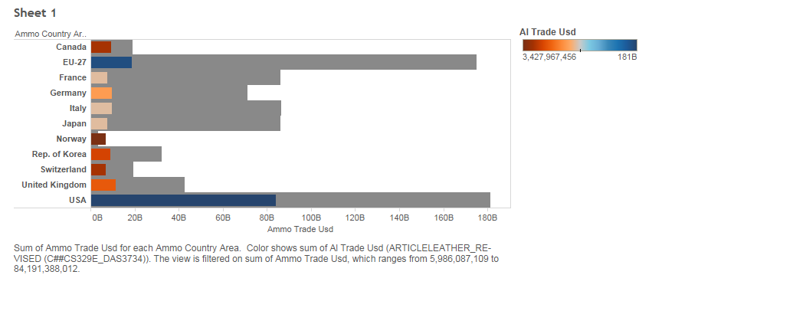
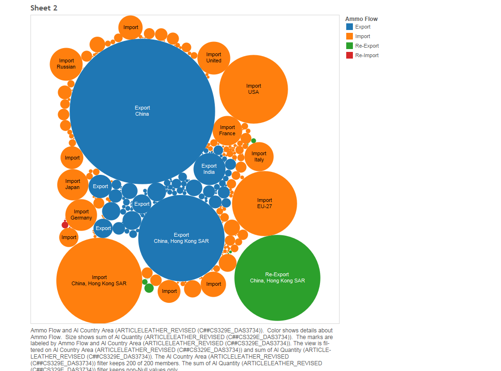
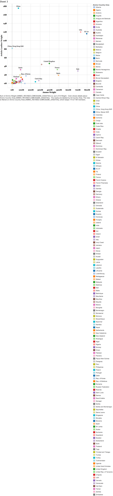

This is the R Markdown file for project 6.

Group members: Travis Cox, Lola Shonaike, and Adam Humphrey

Data source: https://app.enigma.io/search/source/org.un.comtrade

##Summary of data

The data we used for this project is a breakdown of international trade for two commodities: ammunition and leather goods. The data is broken down into 10 segments: 

Country Area - The country that the commodity was imported or exported from
Year - Year which the commodity was imported or exported
Comm Code - The code designated for each import or export
Commodity - A description of the commodity that was traded
Flow - Indicator of whether the commodity was imported or exported
Trade USD - The monetary value of the import or export
Weight - The weight of the import or export in kilograms
Quantity Name - Indicating whether the quantity (the next column) was the number of items or weight of the import or export
Quantity - The number of items or weight of an import or export
Serial ID - An ID number assigned to each trade
### Importing Data
For All of Our Data, We got the CSV Files from https://app.enigma.io/signup. After downloading, the CSV Files, I wrote the Create Table Sql Queries necessary to make the tables.I used this site: http://www.w3schools.com/sql/sql_create_table.asp as a guidance in writing the queries. As for the data types, I typically chose them as Numbers and VarChar of 200, just to make sure the size was large enough for the data type.  Then Afterwards, I imported the CSV data into SQL Developer using Import Data Wizard. You can do this by right click the table, choosing import data. I then, matched the CSV data columns with the data columns, I had. Then it imported the data in for me. If there was an error,maybe a null data in a no null column, or string in a number column, for example, it would usually return a YourTableNamebad.sql. If this was the case, then I wouldmanually go in and delete the specific insert/update query in the DDL statement in that bad sql file to get rid of the problems. Then I would run that file again to try to import the CSV File. 
###Sheet 1

Sheet 1 shows a bullet chart of the total ammo trades in USD overlaid in color by the total article leather trades in USD for countries filtered such that only countries with total ammo trades greater than 5.7 billion are shown.To reproduce the picture above in tableau, place "Ammo Country Area" in "Rows" and "SUM(Ammo Trade Usd)" in "Columns". Then place "SUM(Al Trade Usd)" in "Marks" and select the "Bar" graph option. Then place another "SUM(Al Trade Usd)" into "Color" under in "Marks". This will bring up a legend with a color gradient. Right click on that legend and select "**Edit Colors**" and then under the "Palette" option, pick "Orange-Blue Diverging" and press OK. Next, right click the "SUM(Ammo Trade Usd)" in the "Columns" section and select "**Filter...**". Select "Range of values" and move the lower bound to 5.7 billion and press OK. Next click the Ammo Trade Usd axis at the bottem of the visualization and select "Add Reference Line, Band, or Box." Select "Line". Under "scope" select Per Cell. Under "Line", change "Value:" from "SUM(Ammo Trade Usd)" to "SUM(Al Trade Usd)" and change "Average" to "Sum", finally change "Label:" to "None". Under "formatting" change "Line:" to "None" and change "Fill Below:" to a light gray.

###Sheet 2

Sheet 2 shows a bubble graph, where the size of the bubbles represents the amount of article leather quantity traded by a particular mode (modes such as Export,Import,ect...) by a particular country. The trade modes are color coded with blue for export, orange for imports, green for re-exports and red for re-imports. To reproduce this visualization, place "Ammo Flow" into "Color" and place "SUM(Al Quantity)" into "Size" in "Marks" . Then select the "Circle" option under "Marks". Next, place "Ammo Flow" and, after making sure that "Al Country Area" is linked to "Ammo Country Area", place "Al Country Area" it into "Label" in "Marks". Next, right click on "Al Country Area", and select "**Filter...**" and unselect "Null" in the "General" tab, and press OK. Finally, right click "SUM(Al Quantity)" and select "**Filter...**", choose "Special" and select "Non-null values" and press OK.

###Sheet 3

Sheet 3 shows a graph comparing the weight of a country's ammunition and leather imports and exports. The x-axis represents the total weight of ammunition imports and exports. The y-axis represents the total weight of leather imports and exports. The color of each dot corresponds with each country. This was done because most countries are clustered close to the intersection of the x and y axes. This clump shows that most countries traded less than 2 billion kilograms of ammunition and 200 million kilograms of leather goods. Names of each country also appear next to their respective dot when there is enough space on the graph.

To reproduce this visualization, the following steps need to be taken:
1. Place SUM(Al Weight) in the rows section, and place SUM(Ammo Weight) in the columns section
2. Place the dimension Al Country Area on the label section in the Marks area to the left of the graph
3. Place the dimension Ammo Country Area on the color section to color code each country
4. Change various formatting sections for preference (i.e. text font, shape of marks, and colors for countries)

###Sheet 4

Sheet 4 is box plot is comparing for each Article Leather and Ammonution, the total Number of flows it had(import,export,reexport,reimport) in terms of actual having no quantity, the number of items, and the weight of all the flows. The pattern that is seen on the Top blox plot was what I was expecting. The lowest number would be no quantity to represent the no trade occuring. The Second number that was highest was number of items which represented how much ammonution was traded. The highest being the weight in kilograms. Interestingly enough, Article Leather was opposite with No quantity and Number of Items being about the same, and weight in Kilograms being lower. Yet, this somewhat makes sense as Articles and Leather could vary in different things that could be traded from handbags, to leather belts, to catgut. I also, put some countries on top of the boxplot, to show how they vary. The steps taking to make this visualization were, First get AmmoFlow and Al Flow into Rows and Change their measures to Count, put Ammo Quanity name in Columns and unlclick showing the header, then use AmmoFlow as a Filter 
and Ammo Country Area. Last, for the colors I used AmmoCountry Area, and filtered by names of the countries I wanted to view. After, I also put AmmoCountryArea in labels to see them on the graph. 